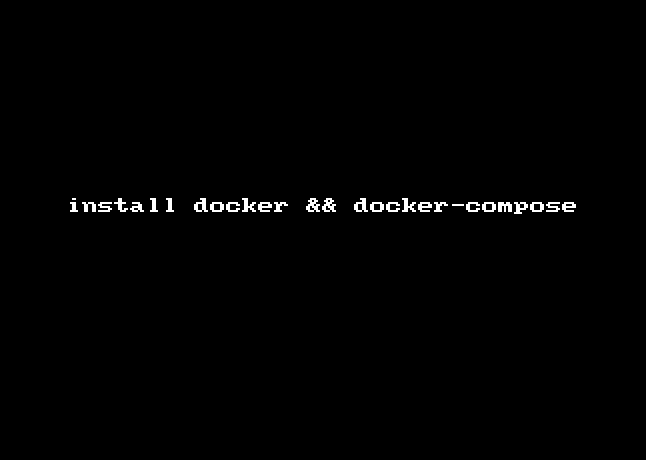

## 使用 toughcli 安装 Docker 

    $ toughcli docker --install

以上指令将自动完成 docker 与 docker-compose 的安装。

实际上，该指令执行了如下语句：

    $ curl -sSL https://get.daocloud.io/docker | sh
    $ curl -L https://get.daocloud.io/docker/compose/releases/download/1.5.2/docker-compose-`uname -s`-`uname -m` > /usr/local/bin/docker-compose
    $ chmod +x /usr/local/bin/docker-compose
    $ chkconfig docker on
    $ service docker start

####  Docker 自定义安装

如果在 docker 安装过程中遇到问题，可以参考最原始最全面的 docker 安装指南。

- [Ubuntu](https://docs.docker.com/engine/installation/linux/ubuntulinux/)
- [Arch Linux](https://docs.docker.com/engine/installation/linux/archlinux/)
- [CentOS](https://docs.docker.com/engine/installation/linux/centos/)
- [CRUX Linux](https://docs.docker.com/engine/installation/linux/cruxlinux/)
- [Debian](https://docs.docker.com/engine/installation/linux/debian/)
- [Fedora](https://docs.docker.com/engine/installation/linux/fedora/)
- [FrugalWare](https://docs.docker.com/engine/installation/linux/frugalware/)
- [Gentoo](https://docs.docker.com/engine/installation/linux/gentoolinux/)
- [Oracle Linux](https://docs.docker.com/engine/installation/linux/oracle/)
- [Red Hat Enterprise Linux](https://docs.docker.com/engine/installation/linux/rhel/)
- [openSUSE and SUSE Linux Enterprise](https://docs.docker.com/engine/installation/linux/SUSE/)

遇到困难不要轻易放弃，你还可以尝试使用[二进制安装](https://docs.docker.com/engine/installation/binaries/)

#### Docker Compose

Docker Compose是在使用Docker容器部署分布式应用时的工具，可以定义哪个容器运行哪个应用。要使用 Docker Compose，Docker 版本必须在1.7+

[官方安装文档](https://docs.docker.com/compose/install/)
