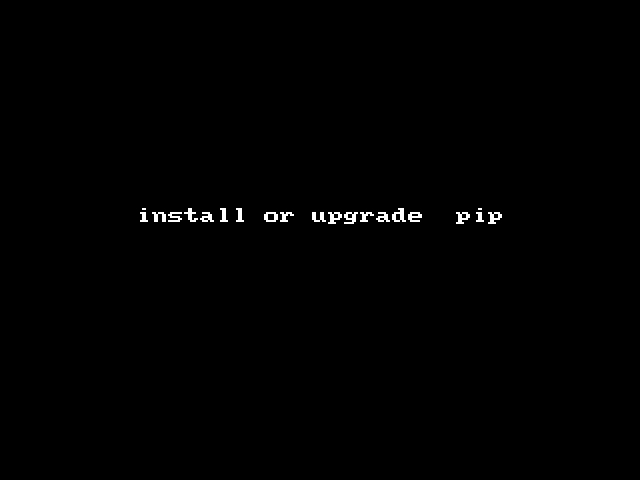
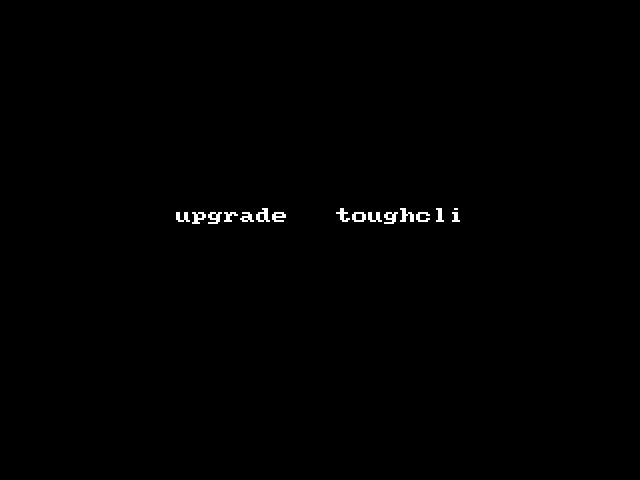

## toughcli 是什么？

toughcli 是一个toughradius以及相关软件的安装配置命令行接口 (Command Line Interface)。它最大的用处就是帮助toughradius的使用者更轻松地完成toughradius及相关软件的快速安装部署，以及实现更方便的运维管理。

toughcli 使用 python 开发，提供了一个可以在 linux终端下使用的命令行脚本"toughcli".  通过 python 的包管理工具可以直接安装toughcli。

##  安装 toughcli

在各个 linux 发行版中一般都支持 python，toughcli 主要依赖于 python2.7以上的版本，在 ubuntu 14，centos7等系统中都自带了 python2.7的版本。

使用 Python 自带的 easy_install包管理工具安装

    $ easy_install toughcli 

或者使用更强大的 pip 工具

    $ easy_install pip

    $ pip install toughcli   

## 升级 toughcli

从 github 仓库升级，可以升级到最新的开发版本

    $ toughcli upgrade --github

从 pypi.python.org 升级，升级到最新的稳定版本。

    $ toughcli upgrade --pypi

## 基本用法

看看这个工具为我们提供了那些功能

    $ toughcli --help

    Usage: toughcli [OPTIONS] COMMAND [ARGS]...

    Options:
    
        --version
        --info     server info
        --help     Show this message and exit.

    Commands:

        docker         install docker and docker-compose
        mysql          install mysql by docker mode
        native_radius  install toughradius by native mode
        native_wlan    install toughwlan by native mode
        radius         install toughradius by docker mode
        redis          install redis by docker mode
        upgrade        upgrade toughcli tools version
        wlan           install toughwlan by docker mode

查看子模块的指令帮助信息

    $ toughcli radius --help

    Usage: toughcli radius [OPTIONS]

        install toughradius by docker mode

    Options:

        --install
        -e, --edit-config               edit radius docker-compose.yml config
        -o, --docker-operate [|ps|config|pull|logs|start|stop|restart|kill|rm|down|pause|unpause|status|upgrade]
                                      docker instance operate
        -d, --rundir TEXT               default:/home/toughrun
        -i, --instance TEXT
        -n, --worker-num INTEGER
        -r, --release [dev|stable|commcial]
        --help                          Show this message and exit.

查看服务器信息：

> 提示：如果你在安装过程中遇到困难，可以通过这个指令反馈一些有用的信息。

    $ toughcli --info
    Linux distribution: CentOS Linux,7.2.1511,Core
    Cli version toughcli: 0.0.7
    Env_home: /root
    Env_path: /usr/local/sbin:/usr/local/bin:/usr/sbin:/usr/bin:/root/bin:/usr/local/bin
    Server platform: Linux-3.10.0-327.4.5.el7.x86_64-x86_64-with-centos-7.2.1511-Core,x86_64
    Python version: CPython,2.7.5
    Docker version 1.8.2-el7.centos, build a01dc02/1.8.2
    docker-compose version 1.5.2, build 7240ff3

    