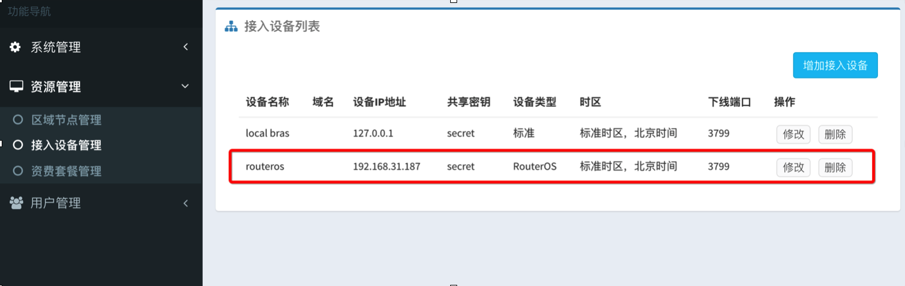
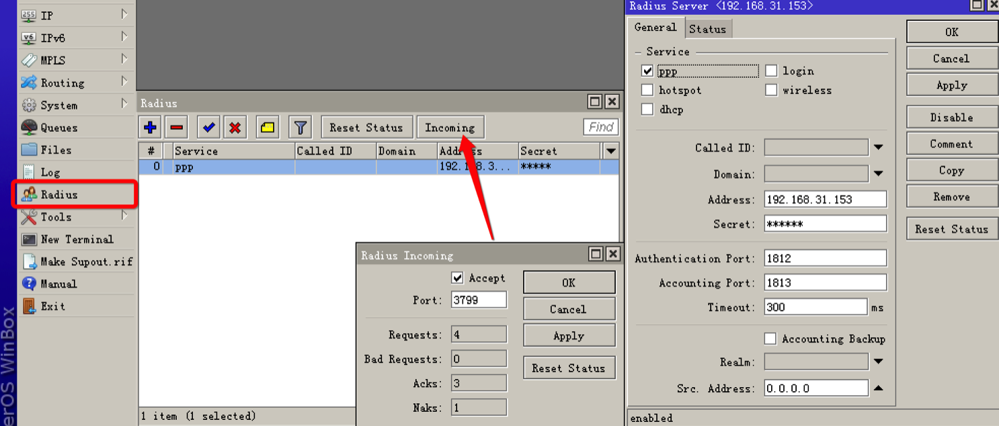
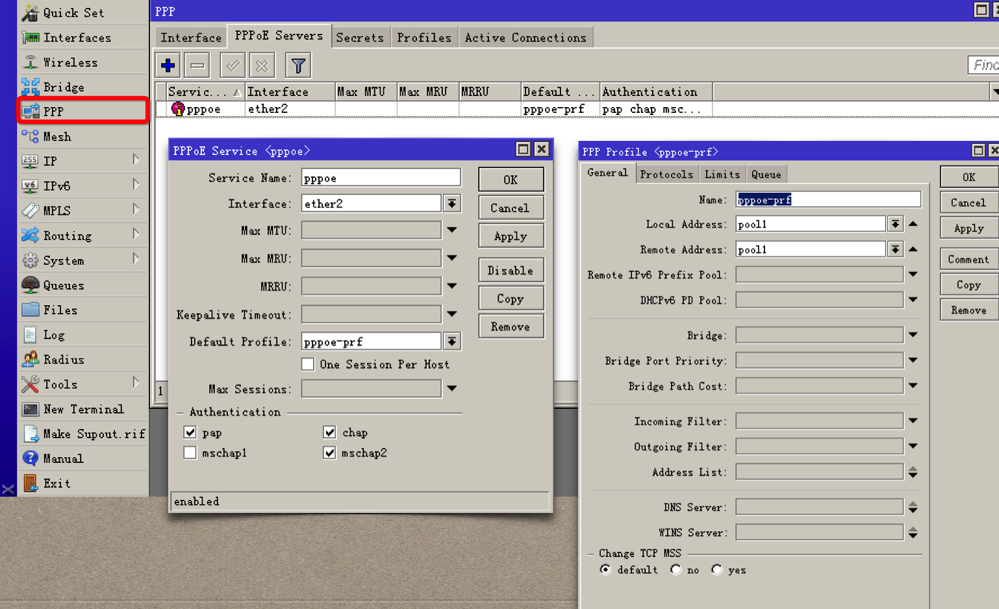
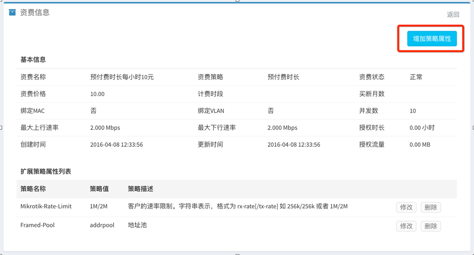

# RouterOS对接指南

## 在ToughRADIUS中增加 接入设备 配置

RouterOS 设备信息必须在 ToughRADIUS 系统中配置，不然所有认证消息会被丢弃。

## RouterOS radius 配置

- radius 服务配置

注意，要使强制下线功能有效，务必启动授权功能，开放3799端口给 Radius。

- 开启RouterOS上的 radius 记账

对于记账间隔，如果是包月类型套餐，记账间隔应该设置的长一点，可以有效减轻 radius 服务器负担，如果希望获取更多的记账数据，适当的调整需要的记账间隔时间。

- RouterOS上的 pppoe 配置

根据实际情况配置地址池，pppoe认证接口，加密选项，通常不要考虑 mschapv1

## RouterOS 对接扩展

通过 ToughRADIUS 的资费策略机制，可以为 RouterOS 增加功能扩展。

*RouterOS 支持的部分 Radius 扩展属性*

    Mikrotik-Recv-Limit  从客户端收到报文总字节数限制,可以用于基于流量记费.
    Mikrotik-Xmit-Limit  发给客户端收到报文总字节数限制,可以用于基于流量记费.
    Mikrotik-Group 用户组,在使用radius认证Mikrotik管理用户时可以用该属性返回用户属于full组还是其他组.
    Mikrotik-Wireless-Forward  转发项,当radius将该属性值=0返回给Mikrotik时,Mikrotik无线客户端的帧不转发到infrastructure
    Mikrotik-Rate-Limit  客户的速率限制。字符串表示，格式为 rx-rate[/tx-rate] [rx-burst-rate[/tx-burst-rate] [rx-burst-threshold[/tx-burst-threshold] [rx-burst-time[/tx-burst-time] [priority] [rx-rate-min[/tx-rate-min]]]] 
    其中，[]中内容表示可选。"rx" 表示客户的上传速率，"tx"客户的下载速率。burst-rate突发速率，burst-threshold突发门限，burst-time突发时长。 
    Mikrotik-Realm  帐号域名后缀。 
    Mikrotik-Host-IP HOTSPOT客户端最初始的IP地址 
    Mikrotik-Mark-Id  防火墙magle链名。只用于HOTSPOT。 
    Mikrotik-Advertise-URL 通知页面地址（URL）。一般用于HOTSPOT
    Mikrotik-Advertise-Interval URL通告时间间隔
    Mikrotik-Ascend-Client-Gateway HOTSPOT应用中，DHCP地址池中客户端的网关地址。  
    Mikrotik-Ascend-Data-Rate 类似与rate-limit但该属性被rate-limit忽略
    Mikrotik-Ascend-Xmit-Rate  下载速率限制但该属性被rate-limit忽略 

